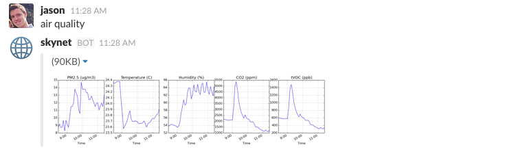

foobot-slack
============

Slack integration for [Foobot](http://foobot.io/).

You can use this script to customize Slack alerts when conditions exceed a certain threshold:


You can also set this up as a bot to enable on-demand air quality graphs:



Setup
-----

foobot-slack has the following dependencies: [slackbot](https://github.com/lins05/slackbot), [pyfoobot](https://github.com/philipbl/pyfoobot>), [matplotlib](http://matplotlib.org/), [imgurpython](https://github.com/Imgur/imgurpython>). They can all be installed using pip:

```
$ pip install slackbot pyfoobot matplotlib imgurpython
```

To set up Slack integration, create an [incoming webhook](https://api.slack.com/incoming-webhooks)

You will also need to [register for a Foobot API key](https://api.foobot.io/apidoc/index.html) and [register for an imgur API application](https://api.imgur.com/#registerapp). imgur is used to host the graph images. Eventually this will be replaced by uploading directly to Slack.

Once all that's ready, you'll need to rename `config.example.txt` to `config.txt` and fill in all values appropriately -- likewise for `slackbot_settings.example.py` to `slackbot_settings.py`. The API parameters for slack, foobot, and imgur are needed for full functionality. All other parameters can be omitted to use default settings.

Usage
-----

To check for alerts, run `python foobot_grapher.py`.

To run as a bot, run `python bot.py`.
