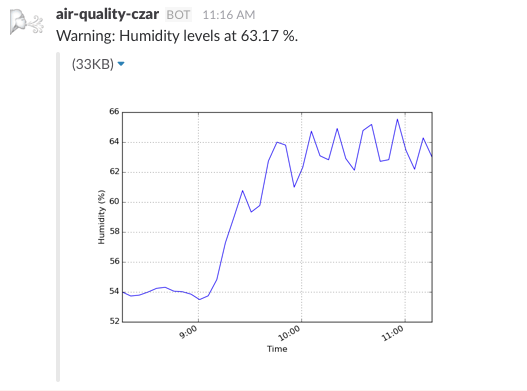

foobot-slack
============

Slack integration for [Foobot](http://foobot.io/).

You can use this script to customize Slack alerts when conditions exceed a certain threshold:



You can also set this up as a bot to enable on-demand air quality graphs:


Setup
-----

foobot-slack has the following dependencies: [slackbot](https://github.com/lins05/slackbot), [pyfoobot](https://github.com/philipbl/pyfoobot>), [matplotlib](http://matplotlib.org/), [imgurpython](https://github.com/Imgur/imgurpython>). They can all be installed using pip:

```
pip install slackbot pyfoobot matplotlib imgurpython
```

You will also need to [register for a Foobot API key](https://api.foobot.io/apidoc/index.html) and [register for an Imgur API application](https://api.imgur.com/#registerapp). imgur is used to host the graph images, since Slack does not support uploading images 
